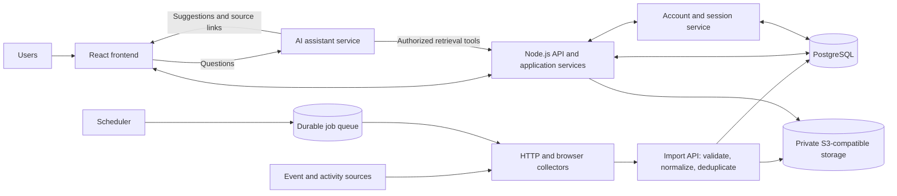
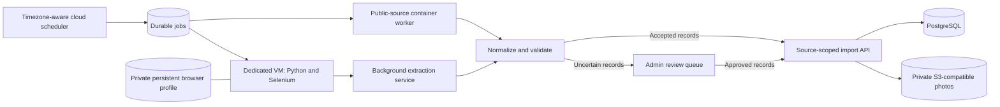

# Winnigo — Target system design

Date: 2026-09-21

Status: **Design for the next version; not yet implemented.** The user selected Node.js, PostgreSQL and S3-compatible storage. Other technology choices below are proposed implementation defaults, not additional user decisions. The current application still runs on Vinext/Cloudflare Workers, D1 and R2. This document does not change deployment, data access or the existing collection schedule.

This is the authoritative target architecture. Documents 01–10 describe the current implementation until the migration is completed; the current README commands remain the instructions for running it today.

Execution roadmap: [12 — Implementation plan](12-implementation-plan.md), with ordered tasks, dependencies and acceptance gates.

## 1. Product and architecture goals

Winnigo collects Winnipeg and Manitoba events, places, trails and activities from multiple sources. Users can browse, search, save discoveries, set preferences and ask an AI assistant for suggestions grounded in the collection.

- Run through ordinary terminal commands and containers, independently of an AI agent vendor or hosting platform.
- Keep the existing visual design, photo galleries, source attribution and map behavior.
- Separate scheduled collection from interactive requests.
- Support individual accounts, preferences and bookmarks across devices.
- Keep private community material accessible only to its authorized audience.
- Preserve source uncertainty, collection freshness, cancellations and owner corrections.

## 2. Selected foundation and proposed stack

| Layer | Target | Decision / rationale |
| --- | --- | --- |
| Application runtime | Node.js, supported LTS release | User-selected runtime; pin a supported version during implementation. |
| Database | PostgreSQL | User-selected relational store for discoveries, accounts and jobs. |
| Media storage | S3-compatible object storage | User-selected portable storage interface; provider remains open. |
| Web framework | Standard Next.js App Router on Node.js | Proposed replacement for Vinext/Workers; reuse existing React components and route organization. |
| UI | React, TypeScript, Tailwind CSS, shadcn/ui | Retain the current design and components. |
| Database access | Drizzle ORM with the PostgreSQL driver | Proposed typed schema, reviewed SQL migrations and repository modules. |
| Authentication | Better Auth, PostgreSQL-backed sessions | Proposed account/session implementation; verify the integration before rollout. |
| Maps | Leaflet | Retain the existing maps and source geometry attribution. |
| Collectors | Existing JavaScript parsers plus Python/Selenium | Reuse parsers; use browser collection only where required and authorized. |
| Background work | Separate Node.js worker and scheduler, PostgreSQL-backed jobs | Durable job state without introducing Redis for the first release. Select a maintained queue implementation during the implementation spike. |
| AI | Server-side provider adapter with typed retrieval tools | Model/provider choice stays configurable. |
| Packaging | Docker images and Docker Compose for development | Same services can run on a VPS or a container platform. |
| Tests | Parser/unit tests, PostgreSQL integration tests and browser tests | Cover data integrity, permissions, styles, hydration and user flows. |

Next.js supports self-hosted Node.js and Docker deployment; using it does not require Vercel. [Next.js self-hosting documentation](https://nextjs.org/docs/app/guides/self-hosting)

Better Auth supports PostgreSQL and a Drizzle adapter. Generate its schema and incorporate reviewed migrations into the project's migration workflow; do not run automatic production schema changes at app startup. [PostgreSQL adapter](https://better-auth.com/docs/adapters/postgresql), [Drizzle integration](https://better-auth.com/docs/installation)

Use the AWS SDK for JavaScript v3 behind a storage interface. Make endpoint, region, bucket and path-style addressing configurable, and test the required operations against the selected S3-compatible provider. [SDK client configuration](https://docs.aws.amazon.com/sdk-for-javascript/v3/developer-guide/migrate-client-constructors.html)

## 3. System structure

Deploy one web/API application initially, with internal modules for authentication, discovery, user profiles, imports, media and AI. The diagram represents responsibilities, not a requirement for separate microservices. Run background jobs in a separate process so collection survives web request timeouts and does not delay browsing.

The browser never connects directly to PostgreSQL or receives storage credentials. The AI service calls the same authorization-aware application services used by the API; it gets no unrestricted database connection or arbitrary SQL tool.

## 4. User accounts and preferences

Proposed first-release login: Google sign-in plus email/password with email verification and password reset. Use a configurable transactional email provider; credentials and delivery configuration are implementation prerequisites. Auth library sessions use secure, HttpOnly cookies in production, with CSRF/origin checks, expiration, revocation and rate limiting.

| Actor | Access |
| --- | --- |
| Visitor | Browse explicitly public discoveries, once public browsing is enabled. |
| Registered user | Public discoveries, own preferences, own bookmarks and authorized AI requests. |
| User with a content grant | Specific restricted sources/listings allowed by that grant. |
| Administrator | Source configuration, moderation, collection operations and access grants. |
| Collector service identity | Import records/media for assigned sources only; no user-profile reads or general admin access. |

Registration is not permission to view private Facebook posts or photos. Existing Hiking Manitoba records remain owner-only on migration. Any broader grant requires an explicit content-access decision; a user's claimed group membership is insufficient. Public launch is a separate step after access tests pass, not a side effect of replacing Basic authentication.

Preferences include interests, preferred area, maximum travel distance, budget/currency, indoor/outdoor preference, family activities, hiking difficulty, route distance and optional accessibility needs. Use a user-selected area or approximate origin by default, not a home address. Distinguish a hard requirement from a ranking preference. Treat missing accessibility information as unknown.

Onboarding asks only for a few interests and travel range; remaining fields are optional and editable. Preferences persist across sessions. Bookmarks are unique per user/listing and sync across devices. Offer an explicit, repeatable import of this browser's existing localStorage bookmarks after login; do not assume all browsers belong to the same person.

Current query constraints override saved preferences for that request. The assistant must ask before saving an inferred preference. Keep an unpersonalized All discoveries view. Notification preferences can be stored later; recommendations must not implicitly subscribe users to messages.

## 5. PostgreSQL data model

Use typed columns for searchable facts and JSONB for source-specific details. Avoid loading every listing into the browser or filtering a single opaque payload column for every request.

| Table / group | Main contents and constraints |
| --- | --- |
| Auth-managed user, account, session, verification tables | Identity, linked providers, sessions and verification/reset state. Use the selected library's schema. |
| `user_preferences` | One row per user; validated preference fields, version and update timestamp. |
| `bookmarks` | User ID, listing ID, saved timestamp; unique `(user_id, listing_id)`. |
| `sources` | Canonical URL, connector type, visibility, schedule, timezone, enabled state and freshness policy. Credentials are secret references, not plaintext fields. |
| `collection_runs` | Source, start/end times, status, cursor/coverage, counts and redacted error details. |
| `listings` | Stable ID, kind, title, description, categories, price/currency, lifecycle state, visibility and timestamps. |
| `listing_sources` | Listing/source links, canonical URL or source record key, normalized source facts, content hash and last-seen timestamp; unique source identity. |
| `occurrences` | Listing ID, local date or confirmed start/end instants, IANA timezone, status and source occurrence key. |
| `locations` | Place name/address, optional coordinates, precision (`trailhead`, `route`, `park`, `lake`, `area`, `unknown`), provenance and optional route geometry. |
| `listing_overrides` | Editorial field overrides and hidden state, editor ID and timestamp. Import never overwrites these. |
| `media` and `listing_media` | Stable media ID, object key, hash, MIME type, size, provenance and ordered listing association. |
| `comment_notes` | Short paraphrase, verified comment URL, listing/source link and inherited visibility. |
| `content_grants` | User, permitted source or listing, granting admin, expiry/revocation and audit reference. |
| `jobs` | Job type/source, schedule key, state, attempts, next retry, lease and heartbeat. Use the chosen queue's schema. |
| `audit_events` | Administrative edits, access changes and collection operations, without raw secrets or private post bodies. |

Keep Community Highlights and Official Trails as collection labels independent of activity categories. Preserve original difficulty scales and seasonal trail variants instead of translating them into unsupported equivalents.

Preserve existing listing IDs where possible so bookmarks and links survive migration. Index source keys, occurrence dates, listing status/visibility and bookmark ownership. Use PostgreSQL text search for the first search release. Add PostGIS if validated geographic-query requirements justify it; initially use bounded coordinate queries and explicit approximate-location labels. Travel radius is straight-line distance unless a routing service is introduced; never label it driving time.

Store confirmed instants as timezone-aware timestamps, but retain date-only and unknown-time values without inventing midnight events. Recurrences expand only within published effective periods and retain source slot identity. Store the original local schedule and `America/Winnipeg` timezone so daylight-saving transitions do not shift local swim or outing times.

## 6. Collection and update pipeline

1. The scheduler creates a durable job with an idempotency key for its source and scheduled slot.
2. A worker claims the job with a lease; duplicate dispatch and retries must not create duplicate listings. Recover expired leases after crashes.
3. The connector fetches bounded data. HTTP parsers handle structured public sources. The separately hosted Selenium collector uses its dedicated signed-in profile and stops on access challenges.
4. Validate and normalize candidate facts. AI extraction is optional for messy text, produces a schema-validated draft and cannot execute source instructions. Ambiguous changes enter an admin review queue.
5. Resolve canonical source identity, deduplicate conservatively and preserve source provenance. Similar titles alone must not merge distinct dates, venues or swim sessions. Keep restricted source details separate from public versions of the same discovery.
6. Upload validated photos to private object storage and upsert the batch transactionally in PostgreSQL. Use idempotent content hashes and clean up unreferenced uploads asynchronously; database and object storage do not share a transaction.
7. Record run status and freshness. On failure retain the last successful collection. A partial scan is not a complete scan; absence from a paginated/private feed does not mean cancellation.

Store retry limits and backoff per connector; distinguish transient network errors from required sign-in or changed source layouts. The latter pause collection and notify the operator. Keep raw private candidates temporary and delete them after confirmed processing. Do not retain member names, contacts or avatars.

Preserve Hiking Manitoba's daily **09:00 America/Winnipeg** schedule, interpreted with timezone/DST rules. Configure other sources individually, initially matching their existing cadence where appropriate. The current scheduler stays active until its replacement passes validation; disable the old dispatcher at cutover to avoid duplicate collectors. Do not migrate or copy Facebook browser cookies into application containers.

### Cloud collection and unattended extraction

The target collector can operate in the cloud without the owner's computer or an interactive coding-agent session remaining online. Moving Selenium alone is insufficient: the current process relies on an agent/person to review candidates and construct the sanitized import batch. Cloud operation must include that extraction and validation stage.

| Workload | Cloud execution model |
| --- | --- |
| Public calendars, free swims and trail exports | Scheduled container jobs or a queue-consuming worker; no persistent signed-in browser required. |
| Hiking Manitoba browser collection | Dedicated cloud VM running Docker, Python and Chrome/Selenium, with a persistent private browser volume. |
| Text extraction and validation | Background service calling the configured model API where permitted, followed by deterministic schema validation and review routing. |

Recommended initial deployment: one dedicated collector VM, separate from the web application, running the collection and extraction containers. Public HTTP collectors can initially run there too and move to managed container jobs later. This keeps browser state and operator recovery straightforward while retaining portable images. Selenium publishes official browser containers; managed job services are an optional execution choice, not an architectural dependency. [Selenium containers](https://github.com/SeleniumHQ/docker-selenium), [Cloud Run jobs example](https://docs.cloud.google.com/run/docs/create-jobs)

Browser session lifecycle:

1. Provision a new dedicated browser profile on the cloud host's private persistent disk. The owner signs in directly through secure remote browser/desktop access; do not copy local cookies or put credentials/profile data into container images.
2. Keep remote browser access behind a VPN or authenticated tunnel, not an exposed browser-control port. Restrict profile access to the collector account; encrypt the host disk and treat it as sensitive session storage, not an S3 photo asset.
3. Run at most one browser collection process per profile, enforced by both the job lease and a host/profile lock. Containers may restart without deleting the profile. Keep browser/driver versions pinned and update them through a tested maintenance process.
4. On sign-in expiry, a challenge or access denial, stop the job, mark the source blocked and notify the owner. Resume only after the owner restores access directly. Cloud hosting does not guarantee that Facebook will accept or retain the session; validate access before schedule cutover and never bypass challenges.

The extraction service replaces the interactive agent step with a bounded, repeatable workflow. It reads only the current run's candidates, preserves actual photo URLs and verified comment links, paraphrases useful facts, removes identity/contact details and validates the output schema. It applies the restricted-content/model-provider policy in section 8; if that policy is not configured, hold restricted candidates for authorized review rather than sending them to an external model. Uncertain dates, contradictory reports and unsupported claims require review or remain explicitly unknown. Never execute instructions embedded in posts or comments.

Track collection, extraction, review and publication as separate stages of a run. A successful browser scan is not a successful import. Retries must not re-upload or duplicate accepted records, and pending review must remain distinguishable from failure. Bound candidate retention, remove processed temporary data after confirmed publication, and expire abandoned candidates according to the configured retention policy. Keep secrets in the host's secret store or protected environment, with source-scoped import credentials.

Monitor job heartbeats, missed runs, retries, blocked sessions, extraction errors, pending review and photo-upload failures. Notify on required action or meaningful changes, not every healthy run. The scheduler uses **09:00 America/Winnipeg**, including daylight-saving changes; do not hard-code a fixed UTC hour. After an outage, enqueue one bounded catch-up job rather than replaying overlapping missed scans.

Cloud cutover requires a verified owner-private destination, a successful fresh sign-in on the cloud browser, a complete collect/extract/import test including photos and comment notes, and restart/retry tests. Validate against an isolated destination or disable publication during parallel comparison. Transfer the single active daily schedule only after those checks pass; retain the local deployment as an inactive fallback. This document does not provision the VM or change the current automation.

Public page requests only read stored records. An administrative refresh queues work and returns a run/job ID rather than waiting for scraping to finish.

## 7. API and application boundaries

Proposed API surface (not current implemented routes):

| Endpoint | Responsibility |
| --- | --- |
| `/api/auth/*` | Auth-library login, callbacks, sessions, verification and recovery. |
| `GET /api/listings` | Authorized, paginated search with category, dates, price, region and collection filters. |
| `GET /api/listings/:id` | Authorized details, provenance, occurrences and media references. |
| `GET/PATCH /api/me/preferences` | Read/update the signed-in user's validated preferences. |
| `GET /api/me/bookmarks` | Paginated authorized saved listings. |
| `PUT/DELETE /api/me/bookmarks/:listingId` | Idempotent bookmark changes. |
| `POST /api/assistant/messages` | Authenticated, rate-limited questions; return grounded suggestions and listing IDs. |
| `POST /api/imports` | Source-scoped authenticated batch imports with idempotency keys. |
| `POST /api/media/import` | Source-scoped validated image upload. |
| `GET /api/media/:id` | Reauthorize the media read, then stream or issue a short-lived signed URL. |
| `/api/admin/sources`, `/api/admin/runs`, `/api/admin/listings` | Role-gated source configuration, queued refreshes and moderation. |

User identity comes from the validated session, never a client-supplied `user_id`. Apply access predicates before pagination, result counts, facets, ranking and AI retrieval. Apply them to cached responses and media too. Return bounded results, validate input with shared schemas and use parameterized database queries.

## 8. Search, personalization and AI assistant

First filter by permissions, lifecycle state and explicit query requirements. Rank eligible records using text relevance, explicit interests, approximate distance, freshness and source diversity. Saved preferences should normally boost results rather than silently hide them. Give a short explanation such as "Matches cycling and your selected travel range."

The assistant uses bounded tools such as `searchDiscoveries`, `getDiscoveryDetails` and `getMyPreferences`. Each invocation carries server-established identity and permission context. Return factual fields, source links, freshness, uncertainty and stable listing IDs; the UI builds cards from authorized records rather than trusting model-generated URLs.

Clearly distinguish official information, community reports and suggestions. The assistant must not invent opening hours, route conditions, availability or precise trail locations. A failed/no-result query should be explicit. AI outages must not break ordinary search or saved items. Limit tool calls, output size and per-user cost. Persist chat history only with a defined retention policy and user controls; start without long-term transcripts.

Keep model credentials server-side. Put provider-specific SDK calls behind one interface and disclose what data is sent externally. Restricted community content requires an explicit provider/data-use policy before it is sent to a model; default to excluding it until that policy is configured. Embeddings/vector search are deferred until keyword search and real user queries demonstrate a need; they must inherit the same access restrictions.

## 9. S3-compatible media

Use private buckets and store object keys, not provider-specific URLs, in PostgreSQL. Preserve existing content hashes and stable `/api/media/:id` references. Authorize every media association and read; knowledge of a hash is not permission. If one image is associated with multiple records, do not infer public visibility from a restricted association.

Validate MIME signatures, byte limits and accepted source hosts. Browser uploads and imported source URLs use separate allowlists. Signed download URLs, if used, expire quickly and must not enter public caches, analytics or logs; proxy reads when immediate revocation is required. Test endpoint/addressing behavior, upload, download, metadata, signed reads and deletion against the chosen provider. No public bucket is required.

## 10. Deployment and operations

The target local Compose environment contains PostgreSQL, a selected S3-compatible development service, the web/API app and a background worker. Browser collection is an optional separate service/host with a persistent private profile. Do not bundle a real signed-in profile into an image.

Use an environment template without real credentials. Planned configuration includes `DATABASE_URL`, `APP_ORIGIN`, auth/session secret, OAuth credentials, email configuration, `S3_ENDPOINT`, `S3_REGION`, `S3_BUCKET`, `S3_FORCE_PATH_STYLE`, storage credentials, model/provider settings and collector credentials. Separate development, test and production values. Pin dependencies and container versions during implementation.

Deployment uses a Node.js/container host, PostgreSQL and any verified compatible object store. Run migrations once per deployment, not once per replica. Add liveness/readiness checks, bounded database pools, structured redacted logs, collection-failure alerts, database backups and a documented restoration test. Keep PostgreSQL and object storage off the public unauthenticated network.

Proposed npm/Compose commands will cover setup, migration, seed, dev, worker, build, start and test. **These commands and Compose files are deliverables of the migration, not instructions that work today.** Use README.md for the current app.

## 11. Migration plan and acceptance gates

| Phase | Deliverable | Acceptance gate |
| --- | --- | --- |
| 1. Runtime foundation | Node.js/Next.js app, repository/storage interfaces, local PostgreSQL/object store and migrations. | Clean setup without Cloudflare or agent-specific tools; browser CSS, JavaScript, layout, maps and galleries work in dev and built app. |
| 2. Data/media migration | Repeatable D1 export/transform/import and private R2-to-S3 object copy. | Compare actual source/export counts, hashes, occurrences, source URLs, hidden flags and overrides. Verify every referenced private object and stable ID mapping. |
| 3. Accounts | Owner bootstrap, individual login, session controls, preferences and bookmarks. | Cross-user reads/writes denied; collector scope tested; restricted source/media grants work; verification/reset flows pass. |
| 4. Collection | Cloud collector VM/containers, durable jobs, scheduled public refreshes, unattended extraction/review and source-scoped Selenium imports. | Fresh cloud sign-in verified; restart/profile locking and retries tested; photos/comment notes preserved; partial/blocked status honest; model data policy enforced; DST schedule and single-dispatcher cutover tested. |
| 5. Discovery and AI | Server search, personalized ranking and bounded assistant tools. | Permission filtering precedes retrieval/ranking; suggestions cite sources; normal discovery works during AI outages. |
| 6. Production cutover | Independent hosting, tested backups and rollback procedure. | Owner validates data, browser behavior and audience before traffic is switched. No automatic public launch. |

Before final copy, pause old writes/collectors for a bounded window, export their last changes and reconcile them. Keep the old site/database/object store intact for rollback. If rollback occurs after new writes, account for those writes explicitly rather than restoring an older snapshot over them. Map the existing owner to a newly authenticated admin using a controlled bootstrap process; never make the first public registrant the administrator.

During migration, preserve the collection labels, approximate map markers, source difficulty scales, discussion notes and photo order. Public export bundles and client seeds must exclude restricted community records. Replace D1 SQL/Worker bindings with PostgreSQL repositories, R2 bindings with the S3 adapter, Basic auth with user sessions, and tool-specific publishing with standard container deployment.

## 12. Remaining implementation decisions

- Hosting provider, PostgreSQL service/version and S3-compatible provider/development image.
- Collector VM provider/sizing, persistent disk, secure remote sign-in access, alert delivery and temporary-candidate retention.
- Exact framework/auth/queue package versions, selected after compatibility tests.
- Google OAuth app and transactional email delivery setup.
- LLM provider/model, cost limits and policy for restricted content.
- Product launch audience, content grants, account deletion and audit/backup retention policy.

These do not reopen the selected Node.js/PostgreSQL/S3 foundation. They must be recorded before the relevant implementation phase ships.
